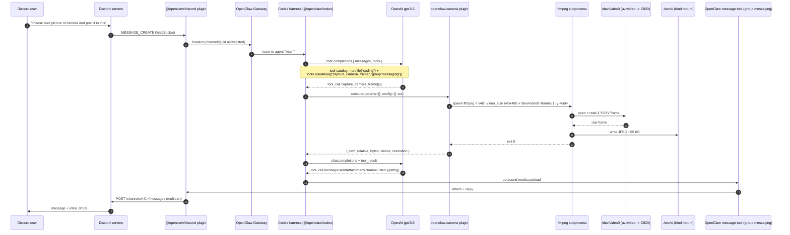

# Camera-capture workflow

End-to-end trace of what happens when a Discord user sends:

> Please take picture of camera and post it in this

This document covers the runtime flow, the components involved, the data
shapes passing between them, and every config / permission gate that has to
be open for the round-trip to succeed.

---

## 1. High-level sequence (Mermaid)



---

## 2. Step-by-step trace

| # | Action | Actor | Where it lives |
|---|---|---|---|
| 1 | User sends Discord message | Discord client | Phone / browser |
| 2 | `MESSAGE_CREATE` pushed over WebSocket | Discord gateway | discord.com |
| 3 | Inbound event handled, guild/channel allow-list checked | `@openclaw/discord` plugin | PID 142 in container |
| 4 | Routed to agent "main" | OpenClaw Gateway | localhost:18789 |
| 5 | Build tool catalog from `tools.profile` + `tools.alsoAllow` | Codex harness | same Node process |
| 6 | Chat completion call | OpenAI gpt-5.5 | api.openai.com |
| 7 | Model decides `capture_camera_frame` | OpenAI | api.openai.com |
| 8 | `execute()` invoked in-process | openclaw-camera plugin | `/opt/openclaw-plugins/openclaw-camera/index.js` |
| 9 | `spawn("ffmpeg", [...])` | Plugin | child process |
| 10 | V4L2 read | uvcvideo + USB | host kernel, C920 |
| 11 | JPEG written | ffmpeg | `./work/camera_<ts>.jpg` (host-visible) |
| 12 | Tool result returned to LLM | Codex | in-process |
| 13 | Second model call to plan reply | OpenAI | api.openai.com |
| 14 | Model decides `message.sendAttachment` | OpenAI | api.openai.com |
| 15 | OpenClaw message tool prepares outbound payload | Built-in (`group:messaging`) | in-process |
| 16 | Multipart upload to Discord API | `@openclaw/discord` | https://discord.com/api/v10 |
| 17 | Channel shows reply + image | Discord client | Phone / browser |

---

## 3. Payload shapes at each hop

| Hop | Payload (truncated) |
|---|---|
| Discord -> Gateway | `MESSAGE_CREATE { author, channel_id, guild_id, content: "Please take picture..." }` |
| Gateway -> Codex | `{ session_id, agent_id: "main", message: {role:user, content:...} }` |
| Codex -> OpenAI (1st) | `{ model:"gpt-5.5", messages:[system,user], tools:[capture_camera_frame, message, ...] }` |
| OpenAI -> Codex (1st) | `{ tool_calls:[{ name:"capture_camera_frame", arguments:"{}" }] }` |
| Codex -> plugin | `params={}, config={}, context={api,toolCallId}` |
| Plugin -> ffmpeg | `argv` list (see step 9 above) |
| ffmpeg -> FS | JPEG bytes (~65 KB) at `/home/jovyan/work/camera_<ts>.jpg` |
| Plugin -> Codex | `{ path, relative, bytes, device:"/dev/video0", resolution:"640x480" }` |
| Codex -> OpenAI (2nd) | Adds `tool_result` message containing the JSON above |
| OpenAI -> Codex (2nd) | `{ tool_calls:[{ name:"message", arguments:{ files:[{path}], text? } }] }` |
| Message tool -> DP | `OutboundMediaPayload { kind:image, path, mime:image/jpeg }` |
| DP -> Discord API | `POST /channels/<C>/messages` multipart: `{ payload_json, files[0]: <bytes> }` |

---

## 4. Gates that have to be open

| Step | Gate | Configured at |
|---|---|---|
| 3 | Guild + channel allow-list | `channels.discord.guilds.<G>.channels.<C>.enabled` (set by 06- hook from `DISCORD_GUILD_ID` / `DISCORD_CHANNEL_IDS`) |
| 5 | Tool exposure to LLM | `tools.profile="coding"` + `tools.alsoAllow=["capture_camera_frame","group:messaging"]` (set by 08- hook) |
| 8 | Plugin enabled and discoverable | `plugins.entries.openclaw-camera.enabled=true` + `plugins.load.paths` (set by `openclaw plugins install --link`) |
| 9 | `ffmpeg` binary exists | apt install in Dockerfile |
| 10 | Kernel-level read access to `/dev/video0` | `jovyan` member of `/etc/group:video` (`RUN usermod -aG video jovyan`) |
| 10 | Device visible inside container | `docker-compose` `devices:` block |
| 11 | Workspace writable | `./work` bind mount + `WORKDIR /home/jovyan/work` |
| 15 | Outbound media dir writable | `/home/jovyan/.openclaw/.openclaw/media/outbound` (state volume, created by openclaw) |
| 16 | Bot can post in channel | `DISCORD_BOT_TOKEN` valid + `SEND_MESSAGES` + `ATTACH_FILES` + `VIEW_CHANNEL` permissions |

---

## 5. Architecture diagram (Mermaid)

```mermaid
flowchart LR
    subgraph CLOUD[Cloud]
        DISCORD[Discord servers]
        OAI[OpenAI gpt-5.5]
    end

    subgraph HOST[Linux host]
        direction TB
        DEV[/dev/video0,video1,media0]
        C920[Logitech HD Pro Webcam C920]
        WORK[./work/ bind mount]
        C920 --- DEV
    end

    subgraph CONT[openclaw-env container]
        direction TB
        GW[OpenClaw Gateway :18789]
        DP[@openclaw/discord]
        CX[Codex harness]
        CP[openclaw-camera plugin]
        FF[ffmpeg subprocess]
        MT[message tool]
        FS[/home/jovyan/work/]
        DP --- GW
        GW --- CX
        CX --- CP
        CX --- MT
        CP --- FF
    end

    DISCORD <-->|"WebSocket + REST"| DP
    CX <-->|"chat.completions"| OAI
    FF -->|"V4L2 read"| DEV
    FF -->|"write JPEG"| FS
    FS === WORK
```

---

## 6. The OpenClaw side: skill / plugin breakdown

### 6.1 Plugin: `openclaw-camera`

Baked into the image at `/opt/openclaw-plugins/openclaw-camera/`:

```
openclaw-camera/
  index.js                # ESM, ~80 LOC
  openclaw.plugin.json    # manifest (id, contracts.tools, activation)
  package.json            # type:module, openclaw.extensions = ["./index.js"]
```

**Manifest (`openclaw.plugin.json`):**

```json
{
  "id": "openclaw-camera",
  "name": "OpenClaw Camera",
  "description": "Capture a still frame from the host camera (V4L2 / ffmpeg). ...",
  "version": "0.1.0",
  "activation": { "onStartup": true },
  "contracts": { "tools": ["capture_camera_frame"] },
  "configSchema": { "type": "object", "additionalProperties": false, "properties": {} }
}
```

**Entry (`index.js`, condensed):**

```js
import { spawn } from "node:child_process";
import { promises as fs } from "node:fs";
import path from "node:path";
import { Type } from "typebox";
import { defineToolPlugin } from "openclaw/plugin-sdk/tool-plugin";

const DEFAULT_WORKSPACE = process.env.OPENCLAW_WORKSPACE || "/home/jovyan/work";

export default defineToolPlugin({
  id: "openclaw-camera",
  name: "OpenClaw Camera",
  description: "Capture a still frame from the host camera via ffmpeg.",
  tools: (tool) => [
    tool({
      name: "capture_camera_frame",
      description:
        "Capture one frame from the host webcam (V4L2) and save it into the workspace. " +
        "Returns the absolute and workspace-relative path; vision-capable models can then read the image.",
      parameters: Type.Object({
        filename:   Type.Optional(Type.String()),
        device:     Type.Optional(Type.String()),
        resolution: Type.Optional(Type.String()),
      }),
      execute: async ({ filename, device, resolution }) => {
        const dev  = device     ?? "/dev/video0";
        const size = resolution ?? "640x480";
        const fname = filename ?? `camera_${new Date().toISOString().replace(/[:.]/g, "-")}.jpg`;
        const out  = path.isAbsolute(fname) ? fname : path.join(DEFAULT_WORKSPACE, fname);
        await fs.mkdir(path.dirname(out), { recursive: true });
        // spawn ffmpeg -f v4l2 ... -frames 1 -y out
        // ...
        const stat = await fs.stat(out);
        return { path: out, relative: path.relative(DEFAULT_WORKSPACE, out), bytes: stat.size, device: dev, resolution: size };
      },
    }),
  ],
});
```

### 6.2 Built-in tools used in the second round

| Tool name | Source | Purpose |
|---|---|---|
| `message` (a.k.a. `message.send`, `message.reply`, `message.sendAttachment`) | OpenClaw built-in, in the `group:messaging` group | Lets the agent post text / attachments back to the originating channel |

These are not part of any custom plugin -- they ship with OpenClaw -- but they are only exposed when `group:messaging` is in `tools.alsoAllow`.

### 6.3 No custom system prompt is used

- The plugin's **tool description** itself is the prompt the LLM reads.
- Each parameter (`filename`, `device`, `resolution`) carries its own typebox `description`.
- The codex harness composes these into the function-calling schema sent to `gpt-5.5`.
- No edits to `IDENTITY.md`, `AGENTS.md`, or any system prompt are required; the model decides to call the tool purely from the description and the user's message.

If we ever wanted deterministic phrasing or multi-step camera workflows (timelapse, multi-frame capture, OCR over a frame, etc.), we would extend the **plugin's tool description / parameter docs** or add a sibling tool, rather than editing the agent identity.

---

## 7. Library inventory

| Layer | Package | Why |
|---|---|---|
| Linux apt | `v4l-utils` | CLI inspection (`v4l2-ctl --list-devices`, format probing) |
| Linux apt | `ffmpeg` | The actual capture engine the plugin spawns |
| Python pip | `opencv-python-headless` | Optional path for JupyterLab notebooks / future custom skills (no GUI deps) |
| npm global | `openclaw@latest` | Gateway, CLI, plugin-sdk, host for Discord/Codex plugins |
| npm global | `@openai/codex` | LLM agent harness (codex CLI binary) |
| Plugin runtime | `typebox` | Parameter schema generator (resolved from openclaw's own `node_modules`) |
| Plugin runtime | `openclaw/plugin-sdk/tool-plugin` | `defineToolPlugin()` factory |

---

## 8. Why two stacked bugs hit us first

1. **Tool gate** -- Plugin was loaded, but the LLM never saw it because the agent's `tools.profile = "coding"` excludes plugin tools. Fixed by adding `capture_camera_frame` to `tools.alsoAllow`.
2. **Group gate** -- ffmpeg ran but couldn't open `/dev/video0` because the codex sandbox spawns child commands via `sudo --user jovyan`, and `sudo` resets supplementary groups using `/etc/group`. The `docker-compose group_add: 44` only fed the container's PID 1, not sudo-children. Fixed by adding `usermod -aG video jovyan` to the Dockerfile so the membership is persisted in `/etc/group`.
3. **Reply gate** -- The agent could capture but had no way to upload back to Discord, because the `message` tool family is also outside the "coding" profile. Fixed by also adding `group:messaging` to `tools.alsoAllow`.

All three fixes are now baked into `before-notebook.d/08-openclaw-camera-plugin.sh` and survive container rebuilds.

---

## 9. One-line summary

> Discord WebSocket -> @openclaw/discord -> Gateway -> Codex harness -> OpenAI gpt-5.5 -> `capture_camera_frame` tool -> `spawn(ffmpeg)` -> `/dev/video0` (Logitech C920) -> JPEG in `./work/` -> Codex sends tool result back to OpenAI -> second tool call `message.sendAttachment` -> @openclaw/discord uploader -> Discord REST API -> channel shows the photo.
